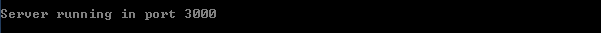
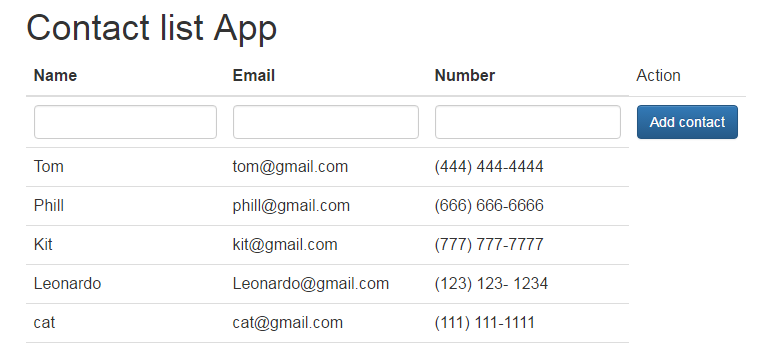

# MEANSample
Simple M.E.A.N application

M - Mongo 
E - Express 
A - AngularJS 
N - NodeJS  

Further reference: https://meanjs.org/

## Prerequisites:

 - NodeJS.
 - MongoDB running in the default port 27017.

## How to run it:

- Open NodeJS commandPompt and navigate to 'MEANSample\app'
- Run: 'npm install'

At this point a folder named 'node-modules' must exist in the same directory

- Run: 'npm start'

At this point you should see message: "Server running in port 3000"

- Open your browser and go to 'localhost:3000'

Now you should be able to see the Contact List App:

